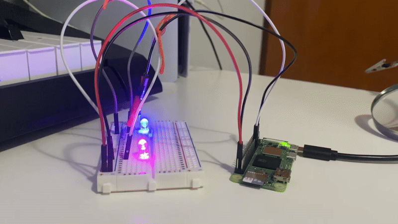

# Weather Alert System
A Raspberry Pi-based Weather Alert System that uses LEDs to indicate real-time weather conditions and thresholds. 

## Overview
The alert system constantly checks the chosen city's weather, and indicates the forecast. Whichever LED is triggered, is the one that starts to blink. If the system detects rain, the pink LED begins to blink. If the forecast is clear skies, the blue LED begins to blink. 

## Core Features
- Continuously monitors daily weather forecast.
-  Blue LED blinks when the day is clear.
-  Pink LED blinks if rain or severe weather is expected.
-  Both LEDs remain ON in idle state.
-  Forecast checks the **entire day**, not just current conditions.
-  Fully automated via systemd service.
-  Handles API errors and network issues gracefully.

## How It Works
1. The service start automatically on boot.
2. weather_tracker.py fetches live weather data at regular intervals from an Open Weather API key.
3. When conditions are met, LEDs are triggered.

## Live Demo



## Hardware

### [Hardware Information](hardware/README.md)

## Notes 
- GPIO pins use **BOARD numbering**.
- Ensure LEDs are connected with correct polarity.
- Optional buzzer can be connected to any free GPIO pin, with a series resistor.
- For testing, the `weather_hardware.py` script can be run independently to verify LED functionality:
```bash.
python3 weather_hardware.py.
